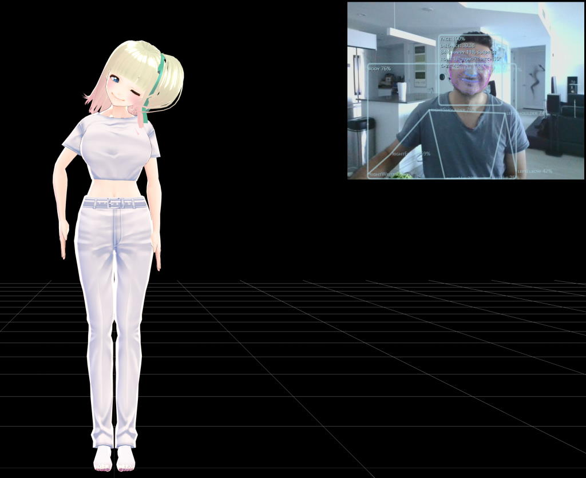

# VR Humanoid Avatar using Human library

**Face, eye and body tracking using [Human](https://github.com/vladmandic/human) library**  
**Used to animate VRM model using [three](https://github.com/mrdoob/three.js) and [three-vrm](https://github.com/pixiv/three-vrm) modules**  

 

## Dev Notes

Install: `npm install`  
Run: `npm run dev`  

- Sources are in `/src`  
- Files in `/server` are HTTP/HTTPS development web server with built-in build and package pipeline  
  Server monitors files in `/src` and on any change creates a new bundle in `/dist`  

 

